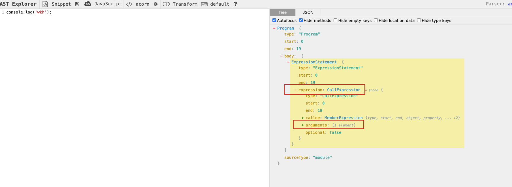
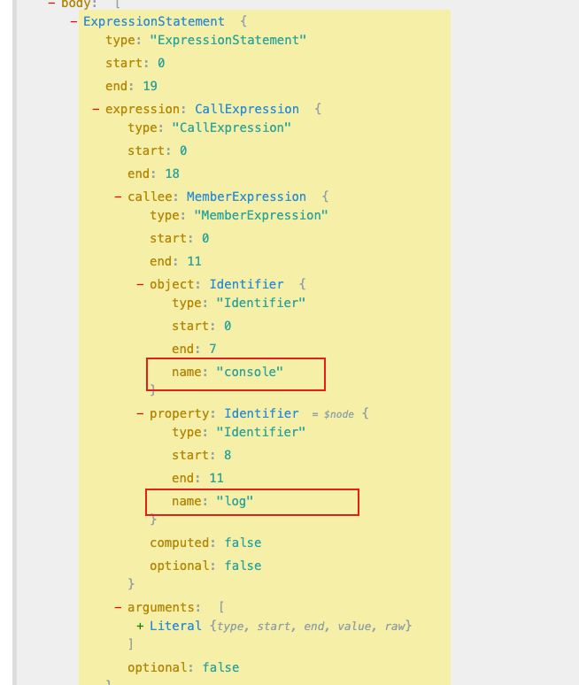

### 初始化项目安装依赖

```shell

npm init -y


npm i @babel/core@7.13.14 @babel/generator@7.13.9 @babel/parser@7.13.13 @babel/template@7.12.13 @babel/traverse@7.13.13 @babel/types@7.13.14 babel-plugin-tester@10.0.0

```

### 需求分析

```
需求1:

    在所有使用 console.log 的地方自动插入 文件名、行号、列号。

    console.log("1");

    转换为：

    console.log('文件名（行号，列号）：', 1);

需求2:
    在所有使用 console.log 的地方 的 前一行 添加 console.log("=============>")。


```

**_console.log 的 ast 语法树：_**






### 思路分析

```
需求1:
1. console.log的节点类型是 CallExpression。需要在遍历 AST 的时候对 console.log 自动插入一些参数，也就是要通过 visitor 指定对 CallExpression 类型节点的 AST 进行修改。

2. CallExrpession 节点有两个属性，callee 和 arguments。分别为 对应调用的 函数名（console、log） 和 参数（wkh）。 所以我们要判断当 callee 是 console.log 的时，在 arguments 的数组中中插入 包含文件名、行列信息的 一个 AST 节点。


需求2:
1. 在当前 console.xx 的 AST 之前插入一个 console.log 的 AST
2. 因为 JSX 中只支持写单个表达式，所以JSX 中的 console 代码不能简单的在前面插入一个节点，而要把整体替换成一个数组表达式。

    <div>{console.log("1")}</div>

    转换为

    <div>{ [console.log('=============>'), console.log('文件名（行号，列号）：', 1)] }</div>

```

### 具体实现

```
参照 src/index.js

```

### babel 插件

```
改造成插件 ，方便功能复用。

作为插件用的时候，并不需要处理 parse、traverse、generate 这些通用流程。
我们需要提供一个 visitor 函数，在这个函数内完成转换功能。

具体参照: usePlugin.js

```
